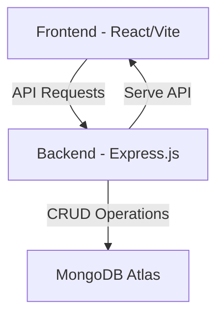

# Application Architecture

## Component Details

### Frontend (React/Vite)
- Built with React and Vite for fast development
- Components:
  - IssueList: Displays issues in a table with filtering and sorting
  - IssueDetail: Shows detailed view of a selected issue
  - CreateIssueForm: Form for creating new issues
  - EditIssueForm: Form for editing existing issues

### Backend (Express.js)
- RESTful API server
- MongoDB integration with Mongoose
- Routes for issue management
- Middleware for CORS and JSON parsing

### Database (MongoDB Atlas)
- Cloud-hosted MongoDB database
- Issue collection with schema validation
- Automatic timestamp management